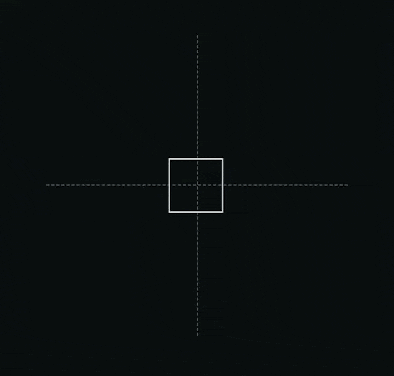

# Drag Lock Direction

## Interactive Design



## Code



## Design Notes

* **Controlling drag direction and animation using Motion.** Useful to return an object to a datum position after manipulating.

## Design Ideas


**React Bits**

[https://motion.dev/examples/react-drag-lock-direction](https://motion.dev/examples/react-drag-lock-direction)


