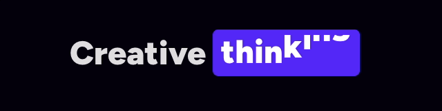
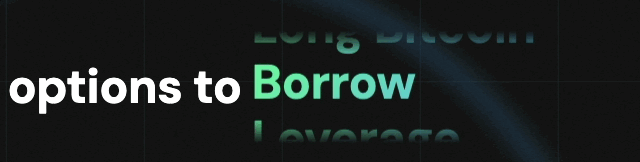

# Rotating Text

## Design Ideas

* [https://www.reactbits.dev/text-animations/rotating-text](https://www.reactbits.dev/text-animations/rotating-text)
  * Pro:
    * Looks good with the spring animation
    * Each character moves independently
  * Con:
    * Text covered by the vertical padding during transition

<figure><figcaption></figcaption></figure>

* [https://defisaver.com](https://defisaver.com/)
  * Vertical rotation used for large screens
  * Linear typing effect used on small screens

<figure><figcaption></figcaption></figure>

<figure><figcaption></figcaption></figure>

