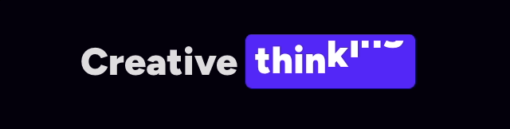
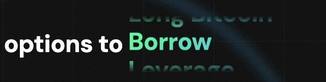
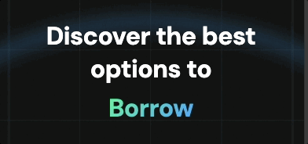

# Rotating Text

## Interactive Design



## Code



## Design Notes

* **Use rotating text as an accent, not content.** It works best for short labels, headlines, or calls-to-action, not paragraphs or instructions.
* **Only rotate when it adds meaning or saves space.** Good for side labels, visual hierarchy, or tight layouts.
* **Prioritize readability.** Keep text short, high-contrast, and at sensible angles (usually 90° or subtle animation, not arbitrary rotations).
* **Be responsive and adaptive.** Rotating text can work well on large screens but should often fall back to horizontal or simpler motion on mobile.
* **Use motion carefully.** Animations should be smooth, predictable, and slow enough to read. Rotating text should never block or compete with core UI elements.

## Design Ideas


**React Bits**

[https://www.reactbits.dev/text-animations/rotating-text](https://www.reactbits.dev/text-animations/rotating-text)

* Pros:
  * Looks good with the spring animation
  * Each character moves independently
* Cons:
  * Text covered by the vertical padding during transition




**DeFi Saver**

[https://defisaver.com](https://defisaver.com/)

* Vertical rotation used for large screens
* Linear typing effect used on small screens



