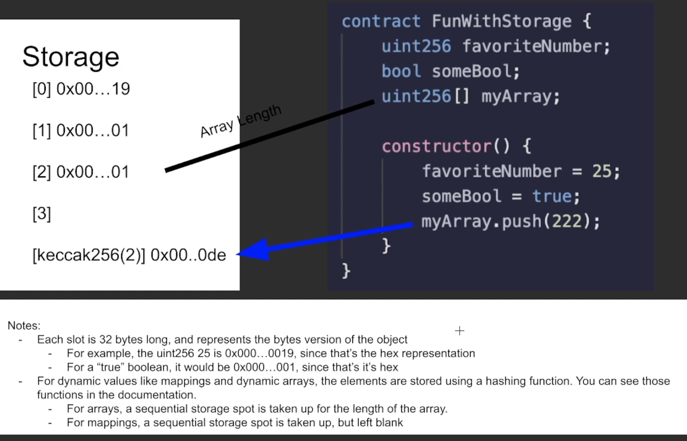

# \*️⃣ Ethernal



Ethernal is like Etherscan for your own private Ethereum chain. This makes it perfect for smart contract development!

It can be run completely locally, but their hosted UI works well.

## Create a Workspace

[https://app.tryethernal.com](https://app.tryethernal.com/)

## Import Contract Addresses

Useful for ERC20 token addresses.

* Enter an address of a contract deployed on Ethereum mainnet.
* If the contract has been verified on Etherscan, its name, and ABI will be pulled automatically.
* If not, the contract will be imported but you'll have to manually add the name and ABI.
* To be able to use this, your workspace needs to be connected to a mainnet fork. If it is not, the contract will still be imported but calls will fail.

<figure><figcaption></figcaption></figure>

## CLI Tool

This CLI tool exports transaction data and contract ABIs to the Ethernal UI automatically.&#x20;

[https://github.com/tryethernal/ethernal-cli](https://github.com/tryethernal/ethernal-cli)

```bash
npm install ethernal -g
```

Set the ETHERNAL\_API\_TOKEN in the `.env` and then use it like this as it doesn't seem to work any other way.

```bash
source .env
ETHERNAL_API_TOKEN=${ETHERNAL_API_TOKEN} ethernal listen
```

## UI - Add proxy read/write field

This code snippet adds a `Proxy Address` field to the `Read/Write` tab on a contract.

* If the contract is accessed via a proxy, input the proxy address to read and write via that proxy address.
* If left blank, it will use the current contract address

<figure><figcaption></figcaption></figure>

### Install Tampermonkey Chrome app



* Enable `Developer mode` for extensions to allow Tampermonkey to work: [https://www.tampermonkey.net/faq.php#Q209](https://www.tampermonkey.net/faq.php#Q209)

### Tampermonkey Script


```javascript
// ==UserScript==
// @name         Modify Ethereum Network Requests with Dynamic Proxy
// @namespace    http://tampermonkey.net/
// @version      0.1
// @description  Intercept and modify Ethereum contract calls with a dynamic proxy address
// @author       EridianAlpha
// @match        https://app.tryethernal.com/*
// @grant        none
// ==/UserScript==

(function() {
    'use strict';

    console.log("Tampermonkey script for modifying fetch requests loaded.");

    let inputPlaced = false;

    // Function to inject an input field
    const injectInputField = () => {
        const interactionsDiv = document.getElementById("interactions");
        if (interactionsDiv) {
            if (!inputPlaced) {
                const label = document.createElement("label");
                label.textContent = "PROXY ADDRESS";
                label.style.display = "block";
                label.style.marginBottom = "5px";
                label.style.color = "gray";
                label.style.margin = "10px 10px 0px 12px";
                label.style.fontSize = "small";
                label.style.fontWeight = "bold";

                const input = document.createElement("input");
                input.id = "tampermonkey-proxy-address";
                input.type = "text";
                input.placeholder = "Proxy address...";
                input.style.margin = "2px 10px 10px 12px";
                input.style.border = "1px solid gray";
                input.style.padding = "8px";
                input.style.minWidth = "500px";
                input.style.borderRadius = "5px";

                interactionsDiv.insertBefore(label, interactionsDiv.firstChild);
                interactionsDiv.insertBefore(input, label.nextSibling);

                inputPlaced = true;
            }
        } else {
            inputPlaced = false;
        }
    };

    // Check for the interactions div
    const checkDivInterval = setInterval(injectInputField, 500);


    // Store the original fetch
    const originalFetch = window.fetch;

    // Define a new fetch
    window.fetch = async function(resource, init) {
        // Check for proxy address in the input field
        const proxyInput = document.getElementById("tampermonkey-proxy-address");
        const proxyAddress = proxyInput && proxyInput.value;

        if (proxyAddress) {
            console.log("Proxy address in use:", proxyAddress);
            // Fetch modification logic
            if (init && init.method === "POST" && typeof init.body === "object" && !Array.isArray(init.body) && init.body !== null) {
            // Convert the body object to a string
                let bodyString = Object.keys(init.body).sort((a, b) => a - b).map(key => String.fromCharCode(init.body[key])).join('');
                let requestData;
                try {
                    requestData = JSON.parse(bodyString);
                } catch (e) {
                    console.error("Error parsing fetch request data:", e);
                    return originalFetch(resource, init);
                }

                if (requestData.method === "eth_call" || requestData.method === "eth_sendTransaction") {
                    console.log("Tampermonkey script: Modifying fetch request data.");
                    requestData.params[0].to = proxyAddress; // Change to your proxy address
                    init.body = JSON.stringify(requestData);
                    console.log("Modified fetch data:", JSON.stringify(requestData));
                }
            }
        } else {
            console.log("No proxy address found - using this contract address");
        }

        // Call the original fetch with modified or unmodified arguments
        return originalFetch(resource, init);
    };
})();
```

