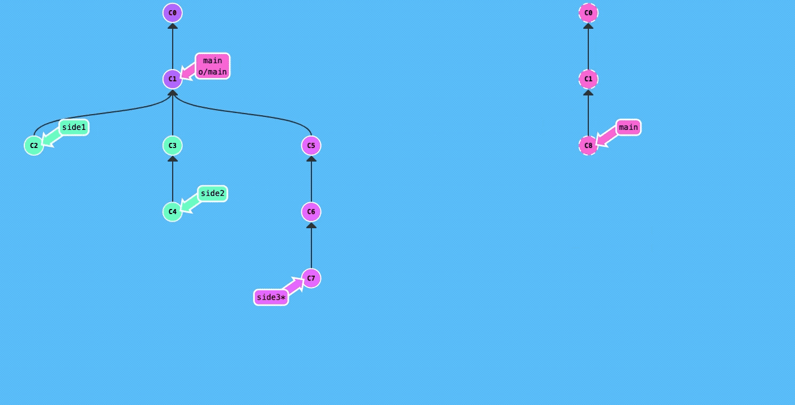
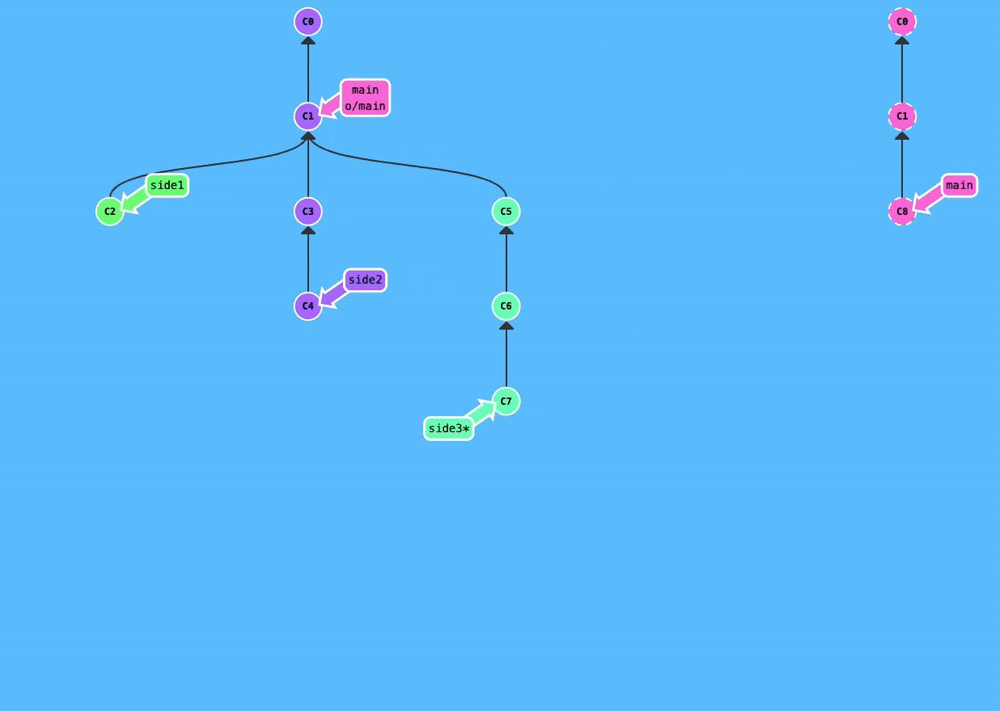
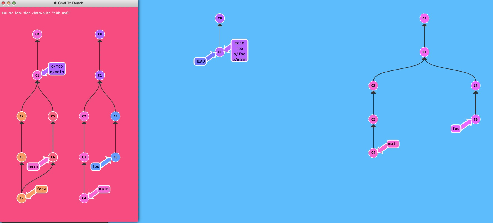

# Merging & Rebasing

* So do you rebase, then merge? It looks like rebase just makes changes?

<table data-full-width="true"><thead><tr><th>Description</th><th>Commands</th></tr></thead><tbody><tr><td><p>Merge two branches</p><ul><li>The branch name used should be the one you are not currently in</li></ul></td><td><code>git merge &#x3C;BRANCH_NAME></code></td></tr><tr><td><p>Rebase one branch onto another</p><ul><li>If you are currently on a branch, you can <code>rebase</code> to move all of the commits in that branch to a new attachment point on a different/new branch</li><li>In the example below, <code>main*</code> was on <code>C3</code> and the command <code>git rebase C2</code> was used to rebase/move <code>C3</code> to after <code>C2</code></li></ul><p><br></p><ul><li>This changes the "base" so that it looks like the features were developed sequentially rather than in parallel</li><li>This makes the git diagram neater</li></ul></td><td><code>git rebase &#x3C;BRANCH_NAME/REF></code><br><code>git rebase &#x3C;REF1> &#x3C;REF2></code></td></tr><tr><td>Completely replace <code>Main</code> with a <code>Branch</code></td><td><p><code>git checkout main</code></p><p><code>git pull</code></p><p><code>git checkout &#x3C;BRANCH></code></p><p><code>git merge -s ours main</code></p><p><code>git checkout main</code></p><p><code>git merge &#x3C;BRANCH></code></p></td></tr></tbody></table>

### Merge Example

```bash
git checkout main
git pull
git merge side1
git merge side2
git merge side3
git push
```

<div data-full-width="true">

<figure><figcaption><p><a href="https://learngitbranching.js.org/">https://learngitbranching.js.org</a></p></figcaption></figure>

</div>

### Rebase Example

```bash
git fetch
git rebase o/main side1
git rebase side1 side2
git rebase side2 side3
git rebase side3 main
git push
```

<div data-full-width="true">

<figure><figcaption><p><a href="https://learngitbranching.js.org/">https://learngitbranching.js.org</a></p></figcaption></figure>

</div>

### Reversing Changes

<table data-full-width="true"><thead><tr><th>Description</th><th>Commands</th></tr></thead><tbody><tr><td><p>Reverses changes by moving a branch reference backwards in time to an older commit</p><ul><li>In this sense you can think of it as "rewriting history"</li><li><code>git reset</code> will move a branch backwards as if the commit had never been made in the first place</li><li><code>--hard</code> deletes commits between current location and the reference used so they are no longer in the history</li></ul></td><td><p><code>git reset &#x3C;REF></code></p><p><code>git reset HEAD^</code></p><p><code>git reset --hard HEAD^</code></p></td></tr><tr><td><p>While resetting works great for local branches on your own machine, its method of "rewriting history" doesn't work for remote branches that others are using.</p><ul><li>In order to reverse changes and share those reversed changes with others, we need to use <code>git revert</code></li></ul></td><td><p><code>git revert &#x3C;REF></code></p><p><code>git revert HEAD</code></p></td></tr></tbody></table>

### Moving things around

<table data-full-width="true"><thead><tr><th>Description</th><th>Commands</th></tr></thead><tbody><tr><td><p>Copy a series of commits below your current location (HEAD)</p><ul><li>Think of <code>cherry-pick</code> like a <code>rebase</code> where the commits added before the current location are specifically selected</li><li>Sure, you can also do some specific selection with <code>git rebase -i</code> but that is only commits in the selected path, <code>cherry-pick</code> commits could come from anywhere</li></ul></td><td><code>git cherry-pick &#x3C;COMMIT_1> &#x3C;COMMIT_2> &#x3C;...></code></td></tr><tr><td><p>Git Interactive Rebase</p><ul><li>Using the <code>rebase</code>  command with the <code>-i</code>  option</li><li>If you include this option, git will open up an editor to show you which commits are about to be copied below the target of the rebase. It also shows their commit hashes and messages, which is great for getting a bearing on what's what.</li><li>It seems to open in <code>vim</code></li></ul></td><td><p><code>git rebase -i &#x3C;REF></code></p><p><code>git rebase -i HEAD~4</code></p></td></tr></tbody></table>

### Git Tags

<table data-full-width="true"><thead><tr><th>Description</th><th>Commands</th></tr></thead><tbody><tr><td>Add a tag</td><td><p><code>git tag &#x3C;TAG_NAME> &#x3C;REF></code></p><p><code>git tag 1.0.0 main</code></p></td></tr><tr><td>Checkout a tag</td><td><code>git checkout &#x3C;TAG_NAME></code></td></tr><tr><td>Push tags to remote</td><td><code>git push &#x3C;REMOTE_NAME> --tags</code></td></tr><tr><td><p>Describe where you currently are relative to the closest "anchor" (aka tag)</p><ul><li>If you don't specify a <code>&#x3C;REF></code> the git will just use where you're checked out right now (<code>head</code>)</li><li>Where <code>&#x3C;TAG></code> is the closest ancestor tag in history, <code>&#x3C;NUM_COMMITS></code> is how many commits away that tag is, and <code>&#x3C;CURRENT_HASH></code> is the hash of the commit being described.</li></ul></td><td><p><code>git describe &#x3C;REF></code><br></p><p><code>OUTPUTS:</code></p><p><code>&#x3C;TAG>_&#x3C;NUM_COMMITS>_g&#x3C;CURRENT_HASH></code></p></td></tr></tbody></table>

### Fetch Arguments Example

```bash
git fetch origin foo:main
git fetch main^ origin:foo
git checkout foo
git merge main
```

<div data-full-width="true">

<figure><figcaption></figcaption></figure>

</div>
